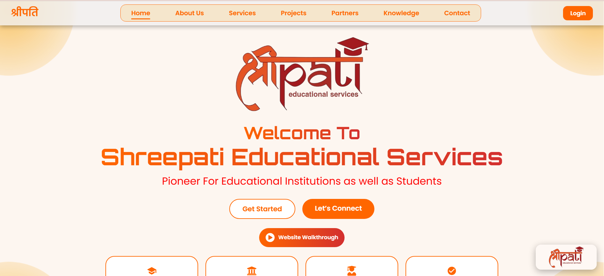
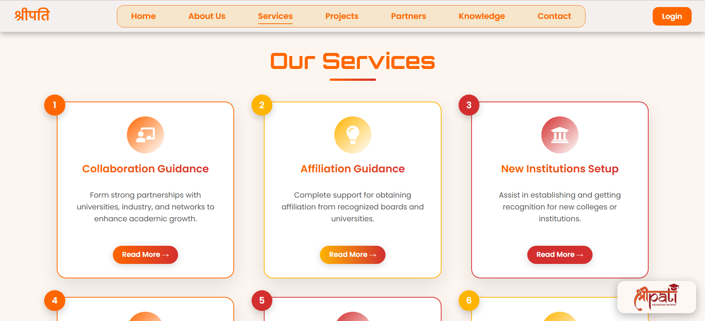
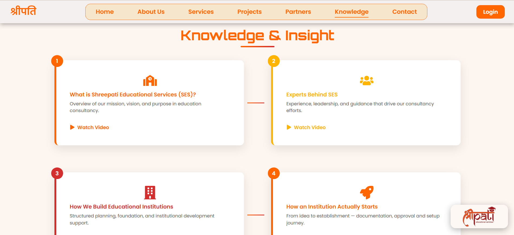

# Shreepati Educational Services (SES) 
> **Advanced Educational Consultancy Platform | Built with React.js**

Shreepati Educational Services is a professional React-based web application providing end-to-end consultancy for institutional growth and student success in Patna, Bihar.

---

##  Interface Showcase

###   Landing Page

*A high-conversion landing page featuring smooth scroll animations and clear service navigation.*

###  Interactive Service Showcase

*A Dedicated page to showcase our services.*

###  Knowledge Videos Showcase

*A High conversion page for videos related to the educational consultancy.*

---

##  Key Features

- **1: React-Powered SPA**: Lightning-fast navigation with zero page reloads using React Router.
- **2: Institutional Checklists**: Comprehensive step-by-step guides for UGC, AICTE, and CBSE affiliations.
- **3: Educational Blog**: A dynamic blog module for sharing the latest updates on educational policies and admissions.
- **4: Portal Hub**: Centralized links to Bihar Student Credit Card, NSP, and government regulatory bodies.
- **5: Fully Responsive**: Custom CSS architecture ensures a perfect experience on any mobile device.

---

##  Tech Stack & Hosting

- **Frontend**: React.js (Hooks, Context API)
- **Routing**: React Router DOM
- **Icons**: React Icons (FontAwesome / Material Design)
- **Styling**: CSS3 with Mobile-First Flexbox/Grid
- **Hosting**: **Vercel** (Continuous Deployment from GitHub)

---

##  Deployment on Vercel

This project is optimized for Vercel. To deploy your own version:

